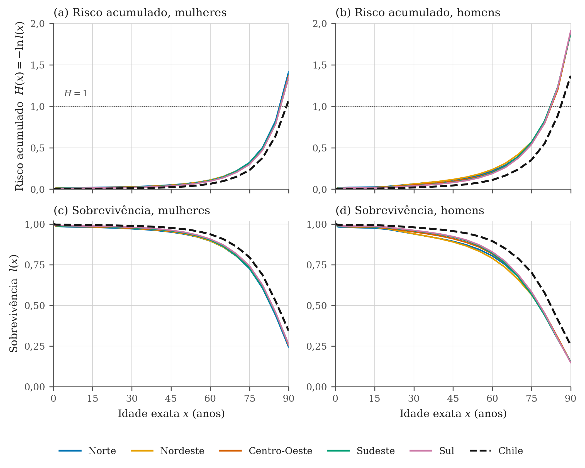
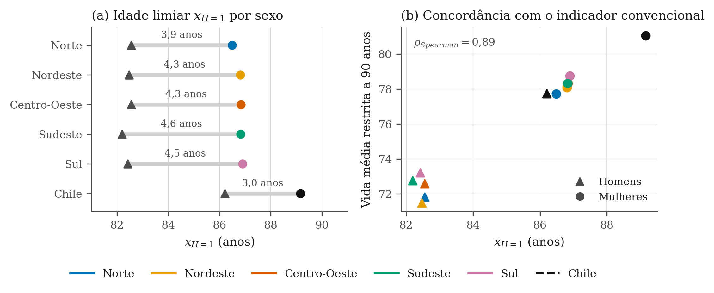
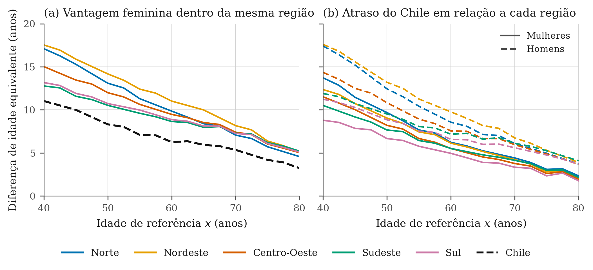
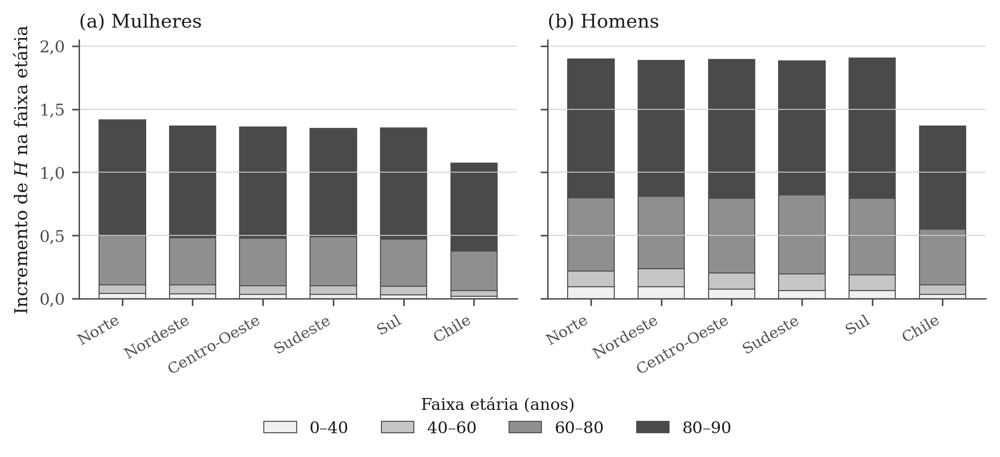
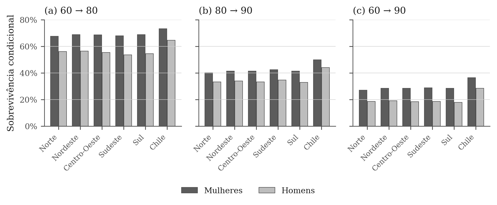
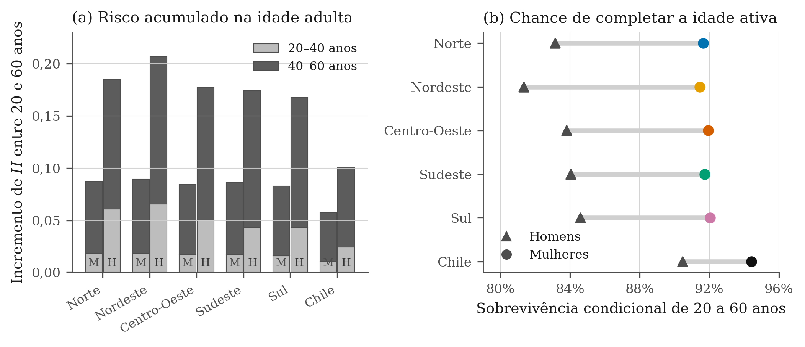

# Medidas alternativas de longevidade: o risco acumulado como escala de tempo

**Projeto:** Medidas Alternativas de Longevidade
**Alunos:** Elber Santos e Evelyn Fragoso
**Dados:** tábuas de vida de período, cinco  regiões do Brasil e Chile, 2023
**Data:** agosto de 2026

---

## 1. Apresentação

Este relatório reúne os resultados da análise desenvolvida até aqui no projeto. O objetivo foi construir e testar um indicador de longevidade que não dependa diretamente da idade cronológica, seguindo a proposta de olhar a sobrevivência excepcional como o processo pelo qual indivíduos escolhidos ao acaso superam a experiência média de mortalidade da sua coorte.

O indicador escolhido é o risco acumulado de mortalidade, $H(x) = -\ln l(x)$, e a idade em que ele atinge o valor 1, que chamamos de $x_{H=1}$. A aplicação empírica compara as cinco regiões brasileiras entre si e com o Chile, por sexo, em 2023.

O texto apresenta o indicador e sua justificativa (seção 3), os resultados (seção 4), as limitações identificadas (seção 5) e os próximos passos sugeridos (seção 6). As análises exploratórias completas, incluindo painéis não reproduzidos aqui, estão no notebook do repositório.

## 2. Dados

Foram usadas doze tábuas de vida de período de 2023: as cinco grandes regiões brasileiras (Norte, Nordeste, Centro-Oeste, Sudeste e Sul) e o Chile, separadas por sexo. As tábuas brasileiras seguem a metodologia do IBGE para as Tábuas Completas de Mortalidade (IBGE, 2024). A tábua chilena foi obtida de fonte oficial equivalente e está registrada em `data/metadata.csv`.

Todas as tábuas estão em formato abreviado, com idades em 0, 1, 5 e depois em grupos quinquenais até 90 anos. A análise usa apenas a coluna $l_x$, normalizada por $l_0$, para manter a comparabilidade entre arquivos de origens diferentes, o limite de 90 anos foi aplicado a todos os grupos.

A escolha da comparação tem uma razão: as cinco regiões brasileiras tem a mesma fonte de dados, o mesmo método de estimação e o mesmo ano, o que separa diferenças reais de mortalidade de diferenças de metodologia. O Chile entrou como referência externa por ser o país sul-americano com mortalidade adulta mais baixa.

## 3. O indicador

### 3.1 Definição

Sendo $\mu(x)$ a força de mortalidade e $l(x)$ a proporção de sobreviventes, o risco acumulado é

$$
H(x) = \int_0^x \mu(t)\,dt = -\ln l(x), \qquad l(x) = e^{-H(x)}.
$$

A relação é biunívoca e não exige hipóteses sobre a forma da mortalidade. A idade limiar é obtida invertendo a função, $x_{H=k} = H^{-1}(k)$, por interpolação linear sobre os pares observados na tábua.

### 3.2 Por que o limiar $k = 1$

Seja $T$ a idade à morte de um indivíduo escolhido ao acaso e $M = H(T)$ o risco que ele acumulou até morrer. Pela transformação integral de probabilidade, $M$ tem distribuição exponencial de parâmetro 1 em qualquer população, ou seja, $P(M > k) = e^{-k}$ e $E[M] = 1$.

Disso decorrem os dois pontos que sustentam o indicador. O primeiro é que a experiência média de mortalidade de uma coorte, medida na escala de risco, vale exatamente 1, e a idade em que ela é atingida é $x_{H=1}$. Quem passa dessa idade superou a mortalidade média da própria coorte, que é o alvo declarado do projeto. O segundo é que a fração que ultrapassa esse ponto é sempre $e^{-1} \approx 36{,}8\%$, o que faz de $x_{H=1}$ um ponto de referência comparável entre regiões, sexos e períodos, sem depender de médias de anos vividos.

### 3.3 Relação com medidas conhecidas

A idade mediana à morte é um caso particular da família $x_{H=k}$, correspondente a $k = \ln 2 \approx 0{,}693$, já que $l(x) = 0{,}5$ nesse ponto. A verificação numérica confirma: para as mulheres do Sul, $x_{H=\ln 2}$ é 83,5 anos e a idade mediana calculada pela curva $l(x)$ é 83,7 anos, com a diferença de 0,2 ano vindo de a interpolação ser feita em escalas distintas nas duas rotas.

A esperança de vida ao nascer, por sua vez, é a integral de toda a curva, $e_0 = \int e^{-H(x)}\,dx$, enquanto $x_{H=1}$ isola um ponto específico dela. Essa diferença aparece nos resultados da seção 4.2.

O risco acumulado também funciona como uma escala de tempo alternativa, já que $dH = \mu(x)\,dx$. Duas populações podem ser comparadas por idade equivalente em risco, $x_B = H_B^{-1}(H_A(x_A))$, isto é, a idade que alguém da população $B$ precisa alcançar para ter acumulado o mesmo risco de alguém de idade $x_A$ na população $A$. É a leitura usada na seção 4.3.

## 4. Resultados

### 4.1 Panorama



**Figura 1.** Risco acumulado $H(x)$ e sobrevivência $l(x)$ por idade exata. Painéis (a) e (c), mulheres; painéis (b) e (d), homens. A linha pontilhada marca o limiar $H = 1$.

As curvas das cinco regiões brasileiras são quase indistinguíveis dentro de cada sexo em toda a faixa etária. A separação visível está entre sexos e entre Brasil e Chile, a partir dos 40 anos. Entre os homens, o afastamento da curva chilena começa por volta dos 20 anos; entre as mulheres, apenas depois dos 50.

Nenhum grupo masculino brasileiro alcança $H = 1$ antes dos 82 anos e nenhum grupo feminino brasileiro antes dos 86 anos. Os homens chilenos cruzam o limiar aos 86,2 anos, praticamente na mesma idade das mulheres brasileiras.

### 4.2 A idade limiar



**Figura 2.** Painel (a): idade $x_{H=1}$ por localidade e sexo, com a diferença em anos indicada acima de cada segmento. Painel (b): relação entre $x_{H=1}$ e a vida média restrita até 90 anos. Círculos indicam mulheres, triângulos indicam homens.

**Tabela 1.** Indicadores de risco acumulado e indicadores convencionais, 2023.

| Localidade   | Sexo     | $H(60)$ | $H(80)$ | $H(90)$ | $x_{H=1}$ | Tempo médio vivido | Idade mediana |
| ------------ | -------- | --------: | --------: | --------: | ----------: | ------------------: | ------------: |
| Norte        | Mulheres |     0,110 |     0,501 |     1,415 |        86,5 |                77,7 |          83,2 |
| Norte        | Homens   |     0,218 |     0,797 |     1,896 |        82,6 |                71,8 |          78,1 |
| Nordeste     | Mulheres |     0,109 |     0,484 |     1,367 |        86,8 |                78,1 |          83,6 |
| Nordeste     | Homens   |     0,236 |     0,810 |     1,888 |        82,5 |                71,5 |          77,7 |
| Centro-Oeste | Mulheres |     0,103 |     0,480 |     1,361 |        86,8 |                78,3 |          83,6 |
| Centro-Oeste | Homens   |     0,203 |     0,794 |     1,892 |        82,6 |                72,6 |          78,1 |
| Sudeste      | Mulheres |     0,103 |     0,491 |     1,349 |        86,8 |                78,3 |          83,5 |
| Sudeste      | Homens   |     0,197 |     0,822 |     1,881 |        82,2 |                72,8 |          77,7 |
| Sul          | Mulheres |     0,097 |     0,470 |     1,352 |        86,9 |                78,8 |          83,7 |
| Sul          | Homens   |     0,188 |     0,795 |     1,906 |        82,4 |                73,2 |          78,2 |
| Chile        | Mulheres |     0,065 |     0,376 |     1,072 |        89,2 |                81,0 |          85,7 |
| Chile        | Homens   |     0,110 |     0,549 |     1,368 |        86,2 |                77,8 |          82,4 |

 Dentro de cada sexo, a amplitude de $x_{H=1}$ entre as cinco regiões brasileiras é de apenas 0,4 ano, tanto entre as mulheres (86,5 a 86,9) quanto entre os homens (82,2 a 82,6). A diferença entre sexos na mesma região vai de 3,9 a 4,6 anos, cerca de dez vezes a amplitude regional. A diferença em relação ao Chile é de 3,6 anos entre homens e 2,3 anos entre mulheres. Saber o sexo de uma pessoa informa muito mais sobre a sua idade limiar do que saber em qual região do Brasil ela vive.

O painel (b) trata da comparação com indicadores convencionais. A correlação de Spearman entre $x_{H=1}$ e a vida média restrita até 90 anos é de 0,89, e entre $x_{H=1}$ e a idade mediana à morte é de 0,95. No eixo da vida média restrita, os cinco grupos masculinos brasileiros ficam isolados abaixo de 74 anos; no eixo de $x_{H=1}$, a separação é menor e o grupo masculino chileno se aproxima dos grupos femininos brasileiros.

Um caso ilustra a distinção. Homens do Sul e do Nordeste diferem em 1,7 ano de vida média restrita (73,2 contra 71,5), mas em apenas 0,05 ano de $x_{H=1}$ (82,42 contra 82,47). A desvantagem nordestina se concentra em idades relativamente jovens e afeta pouco a idade em que o risco igual a 1 é atingido.

### 4.3 Idade equivalente em risco



**Figura 3.** Diferença de idade equivalente em risco acumulado, por idade de referência. Painel (a): idade que uma mulher da mesma localidade precisa alcançar para igualar o risco de um homem da idade indicada, menos essa idade. Painel (b): idade que uma pessoa do mesmo sexo no Chile precisa alcançar para igualar o risco de uma pessoa da região indicada, menos essa idade.

**Tabela 2.** Idade das mulheres com o mesmo risco acumulado de um homem da mesma localidade, em anos.

| Localidade   | Homem de 40 | Homem de 50 | Homem de 60 | Homem de 70 | Homem de 80 |
| ------------ | ----------: | ----------: | ----------: | ----------: | ----------: |
| Norte        |        57,1 |        63,1 |        69,9 |        77,1 |        84,6 |
| Nordeste     |        57,5 |        64,2 |        71,0 |        78,2 |        85,2 |
| Centro-Oeste |        55,0 |        62,0 |        69,5 |        77,4 |        85,0 |
| Sudeste      |        52,8 |        60,5 |        68,6 |        77,3 |        85,2 |
| Sul          |        53,2 |        60,7 |        68,9 |        77,3 |        85,1 |
| Chile        |        51,0 |        58,3 |        66,3 |        75,4 |        83,2 |

Esta é a tradução direta da ideia formulada no escopo do projeto, de que uma pessoa de 60 anos hoje equivaleria a uma pessoa de 50 anos no passado. Aqui a comparação é entre grupos contemporâneos. Um homem de 60 anos no Nordeste carrega o risco acumulado de uma mulher de 71,0 anos da mesma região, uma defasagem de 11 anos. Aos 40 anos, a defasagem chega a 17,5 anos no Nordeste e a 17,1 anos no Norte.

A vantagem feminina cai com a idade de referência em todas as localidades, de 12,8 a 17,5 anos aos 40 anos para 4,6 a 5,2 anos aos 80 anos nas regiões brasileiras. O Chile registra a menor vantagem feminina em todas as idades, o que indica que a redução da mortalidade adulta masculina, e não um ganho feminino adicional, é o que separa o Chile das regiões brasileiras.

O painel (b) confirma esse diagnóstico. Entre os homens, a defasagem em relação ao Chile aos 40 anos é de 17,6 anos no Nordeste, 17,4 no Norte, 14,4 no Centro-Oeste, 11,9 no Sudeste e 11,2 no Sul. Entre as mulheres, a mesma defasagem varia de 8,8 anos no Sul a 13,7 no Norte. A distância diminui rapidamente com a idade: aos 80 anos já é inferior a 4,2 anos entre os homens e a 2,3 anos entre as mulheres.

### 4.4 Onde o risco se acumula



**Figura 4.** Incremento de risco acumulado em faixas etárias mutuamente exclusivas. A altura total de cada barra corresponde a $H(90)$.

A figura separa dois fatos que costumam ser confundidos. Em termos absolutos, o risco se concentra nas idades avançadas: a faixa de 80 a 90 anos responde por 56,3% a 65,2% do total acumulado até os 90 anos, e a faixa de 0 a 40 anos por menos de 5,1% em todos os grupos.

Em termos relativos, as diferenças entre localidades estão nas idades jovens e adultas. Homens do Nordeste acumulam $H = 0{,}095$ entre 0 e 40 anos, contra $H = 0{,}035$ entre os homens chilenos, razão de 2,7. Na faixa de 40 a 60 anos a razão é 1,9, e na de 80 a 90 anos cai para 1,3. Quanto mais jovem a faixa, maior a distância proporcional entre Brasil e Chile.

Essa combinação explica o resultado da seção 4.2. As faixas em que o Brasil mais se distancia do Chile pesam pouco no risco total, mas pesam muito na vida média restrita, porque, com a integral truncada aos 90 anos, uma morte aos 30 anos retira quatro vezes mais anos que uma morte aos 75.

### 4.5 Sobrevivência condicional



**Figura 5.** Probabilidade de sobrevivência condicional entre idades selecionadas, 2023.

Quem chega aos 60 anos no Brasil tem, se for homem, entre 17,9% e 19,2% de chance de chegar aos 90 anos, e, se for mulher, entre 27,1% e 28,8%. No Chile os valores são 28,4% e 36,5%. A comparação na diagonal é a mais informativa: a chance de um homem chileno de 60 anos chegar aos 90 (28,4%) é praticamente igual à de uma mulher brasileira de 60 anos.

A dispersão entre as regiões brasileiras também é pequena aqui, no máximo 2,9 pontos percentuais em qualquer das transições, contra 6,8 a 14,4 pontos percentuais entre sexos na mesma região.

### 4.6 A mortalidade masculina entre 20 e 60 anos



**Figura 6.** Painel (a): incremento de risco acumulado entre 20 e 60 anos, decomposto em 20 a 40 e 40 a 60 anos (M indica mulheres, H indica homens). Painel (b): sobrevivência condicional de 20 a 60 anos.

**Tabela 3.** Sobrevivência condicional entre idades selecionadas, 2023.

| Localidade   | Mulheres, 20 a 60 | Homens, 20 a 60 | Mulheres, 60 a 90 | Homens, 60 a 90 |
| ------------ | ----------------: | --------------: | ----------------: | --------------: |
| Norte        |             91,6% |           83,1% |             27,1% |           18,7% |
| Nordeste     |             91,5% |           81,3% |             28,4% |           19,2% |
| Centro-Oeste |             91,9% |           83,8% |             28,4% |           18,5% |
| Sudeste      |             91,7% |           84,0% |             28,8% |           18,6% |
| Sul          |             92,1% |           84,6% |             28,5% |           17,9% |
| Chile        |             94,4% |           90,5% |             36,5% |           28,4% |

Esta seção isola a faixa responsável pela maior parte da diferença observada antes. Entre 20 e 60 anos, a sobrevivência masculina vai de 81,3% no Nordeste a 84,6% no Sul, contra 90,5% no Chile. Entre as mulheres, os valores brasileiros ficam entre 91,5% e 92,1%, contra 94,4% no Chile, uma diferença bem menor.

Na faixa de 20 a 40 anos, onde a sobremortalidade masculina é mais acentuada, os homens do Nordeste acumulam $H = 0{,}0656$ e as mulheres $H = 0{,}0183$, razão de 3,6. No Chile a razão correspondente é 2,3. O excesso masculino brasileiro nessa faixa é maior tanto em nível quanto em proporção ao feminino.

O resultado é compatível com o perfil epidemiológico documentado para o Brasil, em que as causas externas concentram parcela expressiva dos óbitos masculinos entre 15 e 39 anos (Reichenheim et al., 2011). As tábuas usadas não trazem informação sobre causa de morte, então os dados sustentam a localização etária e por sexo do fenômeno, não a sua explicação causal.

## 5. Limitações

O limite das tábuas aos 90 anos é a limitação principal. O risco acumulado máximo observado vai de 1,07 (mulheres do Chile) a 1,91 (homens do Sul), de modo que apenas $x_{H=1}$ é observável e as demais idades limiares da família, de $x_{H=2}$ a $x_{H=8}$, ficam fora do alcance dos dados. Como o projeto tem interesse em idades excepcionais, o indicador aqui apresentado captura o limiar da experiência média, mas não a cauda da distribuição. A qualidade dos dados em idades muito avançadas no Brasil é ela própria um problema conhecido, e as estimativas de população centenária dependem fortemente do método adotado (Nepomuceno e Turra, 2020).

Duas ressalvas complementares. Tábuas de período descrevem uma coorte sintética exposta às taxas de um único ano, e não a experiência de nenhuma coorte real. E os indicadores derivados de tábuas abreviadas dependem de interpolação entre pontos quinquenais, com erro da ordem de 0,2 ano. Esse erro não afeta conclusões sobre diferenças de 4 a 18 anos, mas é grande demais para sustentar comparações entre regiões brasileiras, cujas diferenças são de 0,05 a 0,4 ano.

Por fim, a comparação com o Chile é descritiva. As tábuas são produzidas por instituições distintas, com procedimentos próprios de correção de sub-registro, e parte da diferença observada pode ter origem metodológica. A cobertura de óbitos no Brasil varia entre regiões e foi estimada em torno de 80% a 85% no início da década de 2010 (Queiroz e Sawyer, 2012), o que reforça a cautela na leitura das diferenças regionais.

## 6. Conclusões e próximos passos

O risco acumulado se mostrou uma escala de tempo útil para o problema do projeto. A idade $x_{H=1}$ tem interpretação probabilística exata, não depende da grade de idades da tábua e generaliza a idade mediana à morte. A conversão entre populações por idade equivalente fornece uma medida em anos, fácil de comunicar, do quanto o envelhecimento em mortalidade de um grupo se adianta em relação ao de outro.

Três resultados organizam a leitura do caso brasileiro em 2023. A variação entre as grandes regiões é pequena em todos os indicadores, o que sugere que recortes por escolaridade, renda ou raça seriam mais discriminantes que o recorte regional. A diferença entre sexos é grande, persistente em todas as regiões e concentrada nas idades adultas jovens. E o atraso em relação ao Chile se origina antes dos 60 anos, dissipando-se nas idades avançadas cobertas pelas tábuas.

Do ponto de vista de política pública, a implicação mais direta vem da Tabela 2. Se um homem de 60 anos no Nordeste apresenta o risco acumulado de uma mulher de 71,0 anos da mesma região, então regras previdenciárias e limiares de idade em programas de saúde que aplicam a mesma idade cronológica aos dois grupos estão tratando como equivalentes posições muito diferentes na trajetória de risco. A discussão sobre a heterogeneidade da população idosa brasileira já aponta nessa direção (Camarano, 2004), e o indicador proposto permite quantificar a distância em anos.

## 7. Nota sobre o uso de ferramentas de inteligência artificial

Na preparação deste relatório foi utilizado um modelo de linguagem (LLM) como ferramenta de apoio, nas seguintes tarefas: redação e organização do texto, correção ortográfica e gramatical, padronização da linguagem entre seções e ajustes de formatação das figuras para o padrão do documento.

Os dados, os cálculos e os resultados apresentados foram produzidos pelo código do repositório, descrito no apêndice. Todos os números citados no texto foram conferidos pelos autores contra a saída do código, e a interpretação dos resultados, as escolhas metodológicas e as conclusões são de responsabilidade dos autores.

---

## Referências

CAMARANO, A. A. (Org.). *Os novos idosos brasileiros: muito além dos 60?* Rio de Janeiro: IPEA, 2004.

INSTITUTO BRASILEIRO DE GEOGRAFIA E ESTATÍSTICA. *Tábuas completas de mortalidade para o Brasil: 2023*. Rio de Janeiro: IBGE, 2024.

NEPOMUCENO, M. R.; TURRA, C. M. The population of centenarians in Brazil: historical estimates from 1900 to 2000. *Population and Development Review*, v. 46, n. 4, p. 813-833, 2020.

QUEIROZ, B. L.; SAWYER, D. O. O que os dados de mortalidade do Censo de 2010 podem nos dizer? *Revista Brasileira de Estudos de População*, v. 29, n. 2, p. 225-238, 2012.

REICHENHEIM, M. E.; SOUZA, E. R.; MORAES, C. L.; MELLO JORGE, M. H. P.; SILVA, C. M. F. P.; MINAYO, M. C. S. Violence and injuries in Brazil: the effect, progress made, and challenges ahead. *The Lancet*, v. 377, n. 9781, p. 1962-1975, 2011.

---

## Apêndice

**Tabela A1.** Participação de cada faixa etária no risco acumulado total observado até os 90 anos.

| Localidade   | Sexo     | 0 a 40 | 40 a 60 | 60 a 80 | 80 a 90 |
| ------------ | -------- | -----: | ------: | ------: | ------: |
| Norte        | Mulheres |   2,9% |    4,9% |   27,6% |   64,6% |
| Norte        | Homens   |   5,0% |    6,5% |   30,5% |   58,0% |
| Nordeste     | Mulheres |   2,8% |    5,2% |   27,4% |   64,6% |
| Nordeste     | Homens   |   5,0% |    7,5% |   30,4% |   57,1% |
| Centro-Oeste | Mulheres |   2,6% |    4,9% |   27,7% |   64,7% |
| Centro-Oeste | Homens   |   4,0% |    6,7% |   31,3% |   58,0% |
| Sudeste      | Mulheres |   2,5% |    5,1% |   28,8% |   63,6% |
| Sudeste      | Homens   |   3,5% |    7,0% |   33,2% |   56,3% |
| Sul          | Mulheres |   2,2% |    5,0% |   27,6% |   65,2% |
| Sul          | Homens   |   3,3% |    6,5% |   31,9% |   58,3% |
| Chile        | Mulheres |   1,7% |    4,4% |   29,0% |   64,9% |
| Chile        | Homens   |   2,5% |    5,5% |   32,1% |   59,9% |

**Tabela A2.** Idade que uma pessoa no Chile precisa alcançar para igualar o risco acumulado de uma pessoa do mesmo sexo na região indicada, em anos.

| Localidade   | Sexo     | Referência 40 | Referência 50 | Referência 60 | Referência 70 | Referência 80 |
| ------------ | -------- | -------------: | -------------: | -------------: | -------------: | -------------: |
| Norte        | Homens   |           57,4 |           62,4 |           68,6 |           76,1 |           83,7 |
| Nordeste     | Homens   |           57,6 |           63,2 |           69,8 |           76,7 |           83,9 |
| Centro-Oeste | Homens   |           54,4 |           60,8 |           67,6 |           75,9 |           83,7 |
| Sudeste      | Homens   |           51,9 |           59,5 |           67,2 |           76,1 |           84,1 |
| Sul          | Homens   |           51,2 |           58,8 |           66,6 |           75,6 |           83,7 |
| Norte        | Mulheres |           53,7 |           59,7 |           66,2 |           74,4 |           82,3 |
| Nordeste     | Mulheres |           52,4 |           59,0 |           66,1 |           74,2 |           82,0 |
| Centro-Oeste | Mulheres |           51,5 |           58,2 |           65,5 |           73,8 |           81,9 |
| Sudeste      | Mulheres |           50,5 |           57,7 |           65,5 |           74,1 |           82,1 |
| Sul          | Mulheres |           48,8 |           56,7 |           64,9 |           73,3 |           81,8 |

**Reprodutibilidade.** Os resultados são obtidos a partir do repositório com:

```bash
pip install -r requirements.txt
python -m pytest
python scripts/build_report_figures.py
```

As tábuas estão em `data/raw/` e catalogadas em `data/metadata.csv`. As funções de cálculo estão em `src/analysis/hazard.py`, `src/analysis/milestones.py` e `src/analysis/indicators.py`. A análise exploratória completa está em `notebooks/01_local_excel_analysis.ipynb`.
